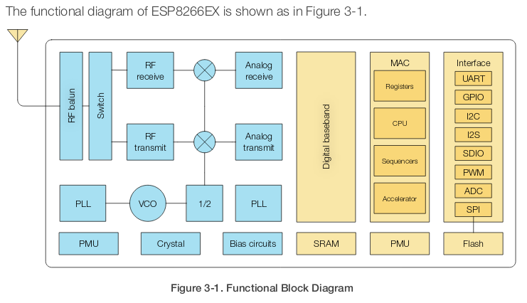

# µPython <!-- .element: style="margin-top:3em" -->
<!-- .slide: data-background="https://upload.wikimedia.org/wikipedia/commons/thumb/4/4e/Micropython-logo.svg/2000px-Micropython-logo.svg.png" data-background-size="30%" data-background-position="top" -->


## ¿Qué es?
Una implementación de Python3 para microcontroladores <!-- .element: class="fragment" data-fragment-index="1" -->

### ¿Qué es un microcontrolador? <!-- .element: class="fragment" data-fragment-index="2" -->
 <!-- .element: class="fragment" data-fragment-index="3" height="40%" width="40%" -->
 <!-- .element: class="fragment" data-fragment-index="4" height="40%" width="40%" -->
[Datasheet ESP8266](https://www.espressif.com/sites/default/files/documentation/0a-esp8266ex_datasheet_en.pdf)
<!-- .element: class="fragment" data-fragment-index="4" -->


## ¿Por qué µPython?
 * Interpretado. Menos velocidad pero portable. 
 * Interactivo. ¡¡Tenemos consola!! 
 * Tenemos muchos [módulos](https://docs.micropython.org/en/latest/library/index.html#python-standard-libraries-and-micro-libraries) a nuestra disposición. 
 * Extensible. Podemos crear los módulos que necesitemos. Python a alto nivel y CPython a bajo nivel. 
### Más alto nivel. <!-- .element: class="fragment" data-fragment-index="5" -->


## Cambios de firmware al instante


## Empecemos...


### ¿Qué necesitamos?
 1. µcontrolador compatible: Pyboard, WiPy, ESP8266, ESP32...
 2. Ordenador con Python3 (solo al principio)
 3. Firmware (intérprete de µPython)
 4. 5 minutos


### Descargar intérprete de la web [http://micropython.org/](http://micropython.org/)
<!-- .slide: data-background="img/download_micropython.png" data-background-position="top" data-background-opacity="0.4" -->


### Instalar esptool
<!-- .slide: data-background="img/installing_esptool.png" data-background-position="top" data-background-opacity="0.1" -->
`pip3 install esptool`


### Flashear el µcontrolador
<!-- .slide: data-background="img/flashing_esp8266.png" data-background-position="top" data-background-opacity="0.1" -->
`esptool.py --port /dev/ttyUSB0 erase_flash`

`esptool.py --port /dev/ttyUSB0 --baud 460800 write_flash --flash_size=detect 0 esp8266-20170108-v1.8.7.bin`

[Docu](http://docs.micropython.org/en/latest/esp8266/tutorial/intro.html#deploying-the-firmware)


## Algo nuevo se huele en el ambiente
<!-- .slide: data-background="img/new_wifi.jpg" data-background-position="top" data-background-opacity="0.2" -->
### ¡¡Y listo para su uso y disfrute!!


## ¿Nos conectamos al aparato?
 * Conexión serie (115200 br):
    * screen, picocom...
    * PuTTY...
 * WiFi: WebREPL (Read Evaluate Print Loop)


## Hacer pruebas con un µcontrolador por WiFi...
# mola <!-- .element: class="fragment" data-fragment-index="1" -->


## Vamos a configurarlo
<!-- .slide: data-background="img/configure_webrepl.png" data-background-position="top left" data-background-opacity="0.2" -->
`import webrepl_setup`

boot.py
```python
import webrepl
webrepl.start()
```

Y lo subimos al µcontrolador:

`pip3 install adafruit-ampy`

`ampy -p /dev/ttyUSB0 put boot.py`


### Incluso lo podemos reiniciar con AMPY
`ampy -p /dev/ttyUSB0 reset`


## WebREPL
<!-- .slide: data-background="img/webrepl.png" data-background-position="top left" data-background-opacity="0.3" -->
[Repo](https://github.com/micropython/webrepl)


## ¿Encendemos un LED?
<!-- .slide: data-background="img/led_builtin.jpg" data-background-position="bottom right" data-background-opacity="0.3" -->
```python
import machine
led = machine.Pin(2, machine.Pin.OUT)
led.value()
led.off() # led.value(0)
led.on()  # led.value(1)
```


# ¿Dudas hasta ahora?
<!-- .slide: data-background="img/questions.jpg" data-background-opacity="0.5" -->


## ¿Y ese `boot.py`?
µPython es más que un intérprete.

### Tiene un sistema de archivos interno. <!-- .element: class="fragment" data-fragment-index="1" -->
Tipo EEPROM (Arduino) pero mejor. <!-- .element: class="fragment" data-fragment-index="2" -->


## Dos archivos especiales
 * `boot.py`: se ejecuta primero, si existe.
 * `main.py`: se ejecuta.

En boot.py se suele configurar el µcontrolador: WiFi, pines... <!-- .element: class="fragment" data-fragment-index="1" -->

En main.py irá la programación del µ. <!-- .element: class="fragment" data-fragment-index="2" -->

### ¡Ojo con el while True! <!-- .element: class="fragment" data-fragment-index="3" -->


## Jugando con el sistema de archivos
```python
f = open('archivo.txt', 'w')
f.write("hola!! estoy en un archivo") # Devuelve la longitud
f.close()
```

```python
f = open('archivo.txt')
f.read()
f.close()
``` 
<!-- .element: class="fragment" data-fragment-index="1" -->


# ¡Eso se puede hacer con EEPROM!
## No es nuevo


## ¿Listar archivos?
```python
import os
os.listdir()
```


## ¿Crear carpetas en un µcontrolador?
```python
import os
os.mkdir('carpeta')
```
## ¿Y eliminarlas? <!-- .element: class="fragment" data-fragment-index="1" -->
```python
import os
os.rmdir('carpeta')
```
<!-- .element: class="fragment" data-fragment-index="1" -->


## ¿Renombrar ficheros?
```python
import os
os.rename('archivo.txt', 'archivo_antiguo.txt')
```
## ¿Eliminar archivos? <!-- .element: class="fragment" data-fragment-index="1" -->
```python
import os
os.remove('archivo.txt')
```
<!-- .element: class="fragment" data-fragment-index="1" -->


# Pequeño "OS"
```python
import os
os.uname()
```
<!-- .element: class="fragment" data-fragment-index="1" -->
¿µPython os ha sorprendido? <!-- .element: class="fragment" data-fragment-index="2" -->


## Módulos disponibles
<!-- .slide: data-background="img/modules.png" data-background-opacity="0.5" data-background-size="contain"  -->
```python
help('modules')
```


## Módulos estándar
 * array
 * math
 * collections / ucollections
 * hashlib / uhashlib
 * json / ujson
 * random / urandom
 * time
 * re / ure
 * zlib / uzlib
 * ucryptolib
 * uheapq


## Módulos específicos
 * btree
 * esp
 * gc
 * io / uio
 * machine: I2C, IRQ, Pin, PWM, RTC, SPI, UART...
 * micropython
 * network: http_client(_ssl), http_server(_ssl)
 * ntptime
 * os / uos
 * sys
 * upip


## Módulos complementarios
 * dht
 * ds18x20
 * lwip
 * neopixel
 * ssd1306
 * onewire
 * umqtt(simple/robust)


 ## Hebras y tareas
  * _thread
  * uasyncio


# ¿IoT?
<!-- .slide: data-background="https://upload.wikimedia.org/wikipedia/commons/4/44/WIFI_icon.svg" data-background-opacity="0.5" data-background-size="contain"  -->
## WiFi


## Configuración básica
```python
import network

wlan = network.WLAN(network.STA_IF)
wlan.active(True)
wlan.isconnected()
wlan.connect('essid', 'password')
wlan.ifconfig()
wlan.ifconfig(('192.168.1.44', '255.255.255.0', '192.168.1.1', '8.8.8.8'))

ap = network.WLAN(network.AP_IF)
ap.active(True)
ap.config(essid='ESP-AP', password='miESPap123')
ap.ifconfig(('192.168.4.1', '255.255.255.0', '192.168.4.1', '8.8.8.8'))
```
[Docu](https://docs.micropython.org/en/latest/library/network.WLAN.html)


## Peticiones
```python
import urequests
respuesta = urequests.get('https://httpbin.org/get')
print(respuesta.text)
```
```python
print(respuesta.json())
```
<!-- .element: class="fragment" data-fragment-index="1" -->
```python
print(respuesta.status_code)
print(respuesta.reason)
```
<!-- .element: class="fragment" data-fragment-index="2" -->
```python
urequests.post('https://httpbin.org/post', data="micropython")
urequests.delete('https://httpbin.org/delete', data="compilar para probar")
urequests.put('https://httpbin.org/put', data="IoT fácil")
```
<!-- .element: class="fragment" data-fragment-index="3" -->


## Servidor
```python
import socket
s = socket.socket(socket.AF_INET, socket.SOCK_STREAM)
s.bind(('', 80))
s.listen(0)
while True:
   conn, addr = s.accept()
   print("Conexión desde: %s" % str(addr))
   request = conn.recv(512)
   print("Contenido recivido: %s" % str(request))
   conn.send("<html><head><title>Servidor ESP8266</title></head><body><h1>Hola desde mi IoT</h1></body></html>")
   conn.close()
```


## Servidor II
```python
import machine
led = machine.Pin(2, machine.Pin.OUT)
import socket
s = socket.socket(socket.AF_INET, socket.SOCK_STREAM)
s.bind(('', 80))
s.listen(0)
while True:
   conn, addr = s.accept()
   print("Conexión desde: %s" % str(addr))
   request = conn.recv(512)
   request = str(request).split(" ")
   if request[1] == "/?LED=ON":
      led.on()
   if request[1] == "/?LED=OFF":
      led.off()
   print("Contenido recivido: %s" % str(request))
   conn.send("<html><head><title>Servidor ESP8266</title></head><body><h1>Hola desde mi IoT</h1><h2>%s</h2></body></html>"%led.value())
   conn.close()
```


# MQTT <!-- .element: style="margin-top: -2.5em" -->
<!-- .slide: data-background="img/mqtt-diagram.png" data-background-opacity="0.5" data-background-size="contain"  -->
[Cliente](https://mqttfx.jensd.de/index.php/download) 


## Librerías incluidas
 * umqtt.simple
 * umqtt.robust


## Suscripción
```python
from umqtt.simple import MQTTClient

def sub_cb(topic, msg):
    print((topic, msg))

c = MQTTClient("ESP8266", "cubie.kcobos.es") # user="usuario", password="secreto"
c.set_callback(sub_cb)
c.connect()
print("Conectando")
c.subscribe(b"prueba")
print("Suscrito a prueba")

while True:
    c.wait_msg()

c.disconnect()
```


## Publicación
```python
import time
from umqtt.simple import MQTTClient

c = MQTTClient("ESP8266", "cubie.kcobos.es")
if not c.connect():
    print("Conectando")

i=0
while True:
    c.publish("prueba", "contando "+str(i))
    time.sleep(1)
    i+=1

c.disconnect()
```


# ¿Hacemos cosas con el µ?
<!-- .slide: data-background="img/toi.jpg" data-background-opacity="0.5" -->


## Salida digital
```python
import machine
led = machine.Pin(2, machine.Pin.OUT)
led.value()
led.off() # led.value(0)
led.on()  # led.value(1)
```


## Lectura digital
```python
import machine
boton = machine.Pin(4, machine.Pin.IN)
boton.value()
```
```python
def boton_irq(p):
    print("El botón ha sido pulsado")
boton.irq(trigger=machine.Pin.IRQ_RISING, handler=boton_irq)
#boton.irq(trigger=machine.Pin.IRQ_FALLING, handler=boton_irq)
```
<!-- .element: class="fragment" data-fragment-index="1" -->


## Lectura sensor
DHT11
```python
import machine
import dht
d = dht.DHT11(machine.Pin(5))
d.measure()
d.temperature()
d.humidity()
```


## Lectura analógica
```python
import machine
lum = machine.ADC(0)
lum.read()
```


## PWM (Pulse Width Modulation)
<!-- .slide: data-background="https://developer.android.com/things/images/pwm-duty.png" data-background-opacity="0.5" data-background-size="contain" -->
```python
from machine import Pin, PWM
pwm0 = PWM(Pin(2))
pwm0.freq() # 0 - 1000
pwm0.freq(1000)
pwm0.duty() # 0 - 1023
pwm0.duty(200)
pwm0.deinit()
```
<!-- .element: class="fragment" data-fragment-index="1" -->
```python
pwm1 = PWM(Pin(2), freq=500, duty=512)
```
<!-- .element: class="fragment" data-fragment-index="2" -->


## Y un largo etcétera


## ¿Cacharreamos?


## Placa de desarrollo
ESP8266 NodeMCU WiFi Devkit

[Datasheet](https://www.handsontec.com/pdf_learn/esp8266-V10.pdf)


<!-- .slide: data-background="img/devkit.png" data-background-opacity="1" data-background-size="contain" -->


## ¿Qué podemos hacer?
 * Controlar una el encendido y apagado de luz, electrodoméstico o calefacción desde nuestro móvil.
 * Controlar una el encendido y apagado de luz, electrodoméstico o calefacción por tiempo.
 * Controlar una el encendido y apagado de luz por luminosidad.
 * Controlar una el encendido y apagado de calefacción por temperatura.
 * Abrir una puerta con tarjeta RFID.
 * Telémetro con ultrasonidos.
